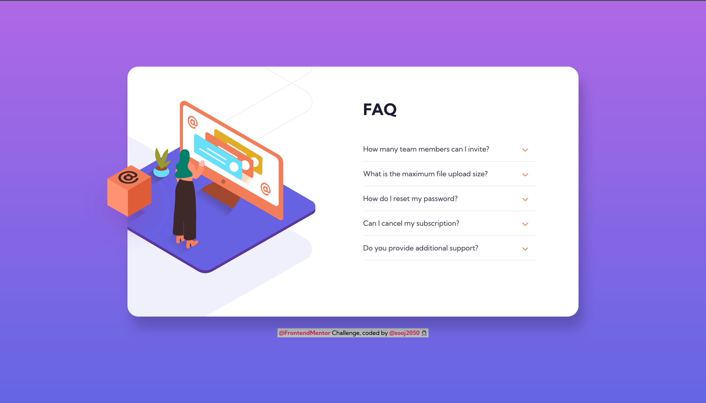

# Frontend Mentor - FAQ accordion card solution

## Table of contents

- [Overview](#overview)
  - [The challenge](#the-challenge)
  - [Screenshot](#screenshot)
  - [Links](#links)
- [My process](#my-process)
  - [Built with](#built-with)
  - [What I learned](#what-i-learned)
  - [Continued development](#continued-development)
  - [Useful resources](#useful-resources)
- [Author](#author)

## Overview

### The challenge

Users should be able to:

- View the optimal layout for the component depending on their device's screen size
- See hover states for all interactive elements on the page
- Hide/Show the answer to a question when the question is clicked

### Screenshot



### Links

- Solution URL: [Add solution URL here](https://your-solution-url.com)
- Live Site URL: [Add live site URL here](https://your-live-site-url.com)

## My process

### Built with

- Semantic HTML5 markup
- CSS custom properties
- Flexbox
- CSS Grid
- Vanilla (pure) JS
- Desktop-first workflow

### What I learned

I learned how to overlay images by combining the method of using absolute positioning and static positioning.

```html
      <div class="left-col">
        <div class="img-overflow-hidden">
          
          
        </div>
            
        </div>
      </div>
```

```css
/* OVERLAY IMAGES */
.img-overflow-hidden {
  position: relative;
  overflow: hidden;

  width: 100%;
  height: 100%;
}

.img-woman {
  width: 29rem;
  position: absolute;
  top: 13.5%;
  left: -18.5%;
  z-index: 3;
}

.img-pattern {
  position: absolute;
  top: -59%;
  left: -135%;
  z-index: 2;
}

.img-at {
  position: absolute;
  top: 39%;
  left: -10%;
  z-index: 999;
}
```

### Continued development

I was challenged by the JavaScript part. I figured out a way to toggle the svg icon buttons and learned how to make the hidden answer part of each accordion panel appear using an active class with the opacity and height properties. However, my code is not clean and needs to be rewritten in the near future when I figure more things out as I learn JS.

```js
`use strict`;

// variables
const q = document.querySelector(`.q`);
const qs = document.querySelectorAll(`.q`);
const btnsArrow = document.querySelectorAll(`.btn-arr`);
const btnArrow = document.querySelector(`.btn-arr`);
const btnIconDown = document.querySelector(`.icon-btn-down`);
const btnsIconDown = document.querySelectorAll(`.icon-btn-down`);
const btnIconUp = document.querySelector(`.icon-btn-up`);
const btnsIconUp = document.querySelectorAll(`.icon-btn-up`);

// function
qs.forEach(panel => {
  panel.addEventListener(`click`, function () {
    // when another panel is clicked, all the other panels collapse
    for (let i = 0; i < qs.length; i++) {
      qs[i].classList.remove(`active`);
    }

    console.log(this);

    // current active/inactive panel when clicked -> toggles active state
    if (this.classList.contains(`active`)) {
      this.classList.toggle(`active`);
    } else {
      this.classList.toggle(`active`);
    }

    // toggling btn icon svgs
    for (let i = 0; i < btnsIconDown.length; i++) {
      if (qs[i].classList.contains(`active`)) {
        btnsIconDown[i].classList.add(`btn-hide`);
        btnsIconUp[i].classList.remove(`btn-hide`);
      } else {
        btnsIconDown[i].classList.remove(`btn-hide`);
        btnsIconUp[i].classList.add(`btn-hide`);
      }
    }

    if (this.classList.contains(`active`)) {
      this.addEventListener(`click`, function () {
        this.classList.toggle(`active`);
        for (let i = 0; i < btnsIconDown.length; i++) {
          if (qs[i].classList.contains(`active`)) {
            btnsIconDown[i].classList.add(`btn-hide`);
            btnsIconUp[i].classList.remove(`btn-hide`);
          } else {
            btnsIconDown[i].classList.remove(`btn-hide`);
            btnsIconUp[i].classList.add(`btn-hide`);
          }
        }
      });
    } else {
      this.classList.toggle(`active`);
    }
  });
});
```

### Useful resources

- [Example resource 1](https://codepen.io/vlt5/pen/MwMjKm) - This helped me with JS.
- [Example resource 2](https://www.youtube.com/watch?v=dTNBRS8ZS4U) - A video I could watch

## Author

- Frontend Mentor - [@kongguksu](https://www.frontendmentor.io/profile/kongguksu)
- Twitter - [@sooj2050](https://www.twitter.com/sooj2050)
